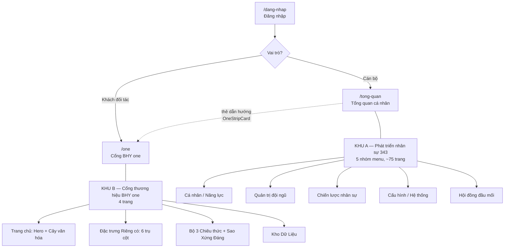

# Cấu trúc tổng thể website sau hợp nhất

**Cập nhật:** 30/07/2026 · Nhánh `claude/bhy-website-integration-99522t`

Tài liệu này mô tả toàn bộ website sau khi gộp **chieuthuc3.com** (ứng dụng phát
triển nhân sự 343) và **BHY one** (cổng thương hiệu bachungyen20-one.vercel.app)
thành một hệ thống duy nhất.

---

## 1. Nguyên tắc hợp nhất

| Hạng mục | Trước | Sau hợp nhất |
|---|---|---|
| Số hệ thống | 2 website, 2 hạ tầng | **1 repo, 1 domain, 1 lần đăng nhập** |
| Backend | Supabase + Firebase/Firestore | **Chỉ Supabase** (Postgres + RLS + Storage) |
| Đăng nhập | 2 tài khoản riêng | 1 tài khoản; BHY one nằm **sau màn đăng nhập** |
| Nội dung BHY one | Sửa trong code / localStorage | Bảng `site_content`, admin sửa trực tiếp trên giao diện |
| Ảnh, tư liệu | base64 trong Firestore | Supabase Storage bucket riêng, đường dẫn có ký số |
| Chia sẻ đối tác | Không có | Vai trò **khách (guest)** có hạn dùng theo ngày |

**Nguyên tắc bảo mật cốt lõi:** không có nội dung nào xem được khi chưa đăng
nhập — kể cả cây văn hóa, 6 đặc trưng riêng có. Khách đối tác chỉ thấy đúng
phần được chia sẻ.

---

## 2. Sơ đồ tổng thể

---

## 3. Lớp truy cập và phân quyền

### 3.1 Bảy vai trò

| Vai trò | Số tài khoản | Phạm vi |
|---|---|---|
| `employee` | 85 | Hồ sơ và biểu mẫu của chính mình + toàn bộ cổng BHY one |
| `manager` | 10 | Thêm: đội ngũ phòng mình, đánh giá cán bộ, báo cáo phòng |
| `pgd` | 3 | Như manager, phạm vi phòng giao dịch |
| `tcth_admin` | 2 | Quản trị nghiệp vụ toàn chi nhánh + **sửa nội dung BHY one** |
| `system_admin` | 1 | Toàn quyền hệ thống |
| `bgd` | 0 | Ban Giám đốc — xem chiến lược nhân sự (chưa gán tài khoản) |
| `guest` | 0 | **Khách đối tác**, có hạn dùng theo ngày (chưa cấp tài khoản nào) |

### 3.2 Ba lớp bảo vệ

1. **Điều hướng (`GuestGate`)** — danh sách trắng `['/one', '/doi-mat-khau']`.
   Route mới thêm về sau mặc định **không** mở cho khách (fail-closed).
2. **Hàng rào thật ở database (RLS)** — **82/82 bảng** đều bật Row Level
   Security. Hàm `is_staff()`, `is_guest()`, `guest_active()` quyết định ai
   đọc được dòng nào. Đã kiểm chứng bằng mô phỏng đăng nhập: khách đang hiệu
   lực thấy 21 mục nội dung + 1 bài được chia sẻ + **0 dòng** dữ liệu nhân sự;
   khách hết hạn thấy **0 dòng**.
3. **Kho tệp phân vùng** — bucket `bhy-one` riêng tư; ảnh nội bộ nằm ở
   `staff/…`, ảnh chia sẻ nằm ở `shared/…`. Bấm "Chia sẻ đối tác" hệ thống tự
   sao chép ảnh sang vùng `shared/`.

### 3.3 Vòng đời tài khoản khách

Admin vào **Cấu hình → Tài khoản khách** (`/quan-tri-khach`) → nhập email + số
ngày hiệu lực → hệ thống tạo tài khoản kèm mật khẩu tạm. Khách đăng nhập rơi
thẳng vào `/one`, thấy dải băng đếm ngày còn lại. Hết hạn: đăng xuất tự động và
RLS chặn mọi dữ liệu.

---

## 4. KHU A — Ứng dụng phát triển nhân sự 343

Giữ nguyên toàn bộ, không thay đổi cấu trúc. Menu chia 5 nhóm:

| Nhóm | Nội dung chính | Ai vào được |
|---|---|---|
| **Cá nhân / Năng lực** | Tổng quan, Tự đánh giá, Hành động phát triển (Kanban), Chiến dịch học tập, BHY Quizzi, Mẹo hay, Skill lõi theo vị trí, Hồ sơ cá nhân | Mọi cán bộ |
| **Quản trị đội ngũ** | Đội ngũ phòng ban, Đánh giá cán bộ, Phân nhóm, Danh sách CB, Báo cáo, Quản trị Quizzi, Dấu ấn BHY Mark, Hội đồng đầu mối | manager / pgd / admin |
| **Chiến lược nhân sự** | Bản đồ rủi ro năng lực, Con đường sự nghiệp, Mô phỏng điều chuyển | BGĐ + Phòng TCTH |
| **Cấu hình / Hệ thống** | Kỳ đánh giá, cấu hình skill, khóa học VietinBank, phòng ban, duyệt user, **Tài khoản khách**, quản trị AI/Email, Cài đặt | admin |
| **Biểu mẫu** | BM01, BM02, BM03 | Theo phân công |

Tổng **80 route**, 75 trang, chạy tải chậm (lazy) theo từng trang.

---

## 5. KHU B — Cổng thương hiệu BHY one

Địa chỉ gốc `/one`. Có thanh điều hướng riêng (Trang chủ · Đặc trưng Riêng có ·
Bộ 3 Chiêu thức · Kho Dữ Liệu) và giao diện
"đảo sáng" tách khỏi tông màu của ứng dụng nhân sự.

### 5.1 `/one` — Trang chủ cổng

- **Hero** — thông điệp 20 năm thành lập chi nhánh.
- **Cây văn hóa** — 5 trụ cột (gốc, thân, cành, lá, quả) bấm xem chi tiết; ảnh
  cây đổi được qua khóa nội dung `culture.tree_image`.
- **Thẻ dẫn hướng** sang 3 khu còn lại.

### 5.2 `/one/dac-trung` — 6 đặc trưng riêng có

Sáu tab trụ cột, mỗi tab có thư viện ảnh admin đổi được tại chỗ:

| # | Trụ cột | Có dữ liệu thật? |
|---|---|---|
| 1 | Công Nghệ Số & Ứng Dụng AI | Không (giới thiệu + thư viện ảnh) |
| 2 | BHY Connect (Hội nghị & hệ sinh thái) | Không |
| 3 | BHY Sharing | Không (nút đăng tư liệu vào Kho Dữ Liệu) |
| 4 | BHY Quizzi | Liên kết sang **hệ Quizzi thật** ở `/quizzi` |
| 5 | **BHY Ideas** | **Có** — hệ thống sáng kiến đầy đủ |
| 6 | **BHY Credit 360** | **Có** — sổ nhật ký phiên họp thẩm định |

**BHY Ideas** (trụ cột 5): biểu mẫu 9 trường → danh sách xếp theo 11 đơn vị →
mỗi ý tưởng có huy hiệu cấp đề xuất/phạm vi áp dụng/đề xuất Hội đồng/có demo,
cấp độ phát triển (🌱 Ươm mầm → 🌿 Bén rễ → 🌳 Vươn cành → ⭐ Lan tỏa), bình
chọn thích/không thích, bình luận. Bảng thống kê tự tính dự toán thưởng
(100k/300k/1M/3M mỗi cấp). Admin đổi cấp độ, chuyển phòng, xuất CSV lọc ngày.

**BHY Credit 360** (trụ cột 6): đăng ký phiên họp 8 trường (ngày họp, phòng đề
xuất, khách hàng, lĩnh vực, doanh thu, hạn mức, CBTĐ, LĐP) → bảng tra cứu tìm
kiếm/lọc phòng; cán bộ sửa phiên của mình, admin xóa và xuất CSV.

### 5.3 `/one/chieu-thuc` — Bộ 3 Chiêu thức + Sao Xứng Đáng

- **Chiêu thức 1** Năng Lượng Ngày Mới · **2** Lập Kế Hoạch 5W2H ·
  **3** Phát Triển Nhân Sự (có khung xem tài liệu khung năng lực).
- **Sao Xứng Đáng 2026** — chương trình ghi nhận, gồm:
  - Biểu mẫu ghi nhận (Cảm ơn / Vì đã / Đem lại + 1–3 sao) **lưu phiếu thật**.
  - Bảng phân bổ 412 sao theo đơn vị + tủ quà 500 triệu.
  - **Khối phân tích 3 tab**: Cá nhân (bảng quy đổi thưởng từng người) ·
    Phòng ban (so với chỉ tiêu) · Chi tiết (toàn bộ phiếu).
  - Admin nhập Excel/CSV có **màn xem trước kèm cảnh báo từng dòng** trước khi
    ghi, tải file mẫu, xuất Excel 3 sheet.

### 5.4 `/one/kho-du-lieu` — Kho Dữ Liệu

Thư viện tư liệu nội bộ: lọc theo chuyên mục/phòng/thẻ, tìm kiếm, thích, xem
chi tiết. Đăng bài **nhiều ảnh** (tự nén 800px), 3 trường bổ sung (chi tiết áp
dụng, giá trị mang lại, phạm vi áp dụng). Admin bật "Chia sẻ đối tác" cho từng
bài — đây chính là **cửa duy nhất** khách đối tác thấy dữ liệu.

---

## 6. Hai hệ giao nhau ở đâu

1. **Một màn đăng nhập** — cùng bảng `profiles` + `user_roles`.
2. **Thẻ OneStripCard** trên `/tong-quan` dẫn cán bộ sang cổng BHY one.
3. **Nhóm menu "BHY one"** trong thanh bên của ứng dụng nhân sự.
4. **Trụ cột BHY Quizzi** trỏ sang hệ Quizzi thật ở khu A (không dựng lại).
5. **Quyền quản trị nội dung** dùng chung vai trò `tcth_admin` /
   `system_admin` — không sinh thêm hệ quyền riêng.

---

## 7. Dữ liệu và hạ tầng

### 7.1 Các bảng riêng của cổng BHY one

| Bảng | Vai trò | Khách xem được? |
|---|---|---|
| `site_content` | 21 mục nội dung chữ, admin sửa tại chỗ | Có |
| `portal_uploads` + `portal_upload_likes` | Kho Dữ Liệu, lượt thích | Chỉ bài được chia sẻ |
| `portal_images` | Thư viện ảnh trụ cột / chiêu thức | Có |
| `portal_ideas` + `portal_idea_votes` + `portal_idea_comments` | BHY Ideas | **Không** |
| `star_records` | Phiếu Sao Xứng Đáng | **Không** |
| `portal_credit_sessions` | Nhật ký Credit 360 | **Không** |
| `guest_access` | Hạn dùng của tài khoản khách | Chỉ dòng của mình |

Tổng toàn hệ thống: **82 bảng**, tất cả bật RLS. Bucket riêng tư `bhy-one`
(hiện 13 tệp). 21 hàm biên (edge function) cho email, AI, tạo tài khoản…

### 7.2 Những sửa lỗi mang theo khi chuyển hệ

Bản BHY One cũ có 5 lỗi đã được sửa khi chuyển sang hệ mới, thay vì tái tạo:

1. **Bình chọn mất phiếu** — lưu dạng mảng nên hai người bấm cùng lúc ghi đè
   nhau → chuyển sang bảng bình chọn riêng, mỗi người một dòng.
2. **23 sao "mồ côi"** — phiếu cá nhân dạng "Tên - Phòng" bị nhận nhầm là phiếu
   tập thể → tách tên/phòng trước khi phân loại.
3. **Thống kê phòng thiếu sao cá nhân** → cộng đủ cả sao cá nhân và tập thể.
4. **Phiếu ghi nhận không được lưu** (chỉ hiện hiệu ứng rồi mất) → ghi thật.
5. **Quyền admin chỉ ẩn ở giao diện** → chốt bằng RLS và hàm có kiểm tra quyền
   ở database; ai cũng sửa được bài người khác → chỉ chủ sở hữu hoặc admin.

### 7.3 Trạng thái dữ liệu

| Nhóm dữ liệu | Trạng thái |
|---|---|
| 21 mục nội dung chữ | ✅ Đã chuyển đủ |
| 10 bài Kho Dữ Liệu + ảnh | ✅ Đã chuyển đủ (13 tệp) |
| 92 ý tưởng BHY Ideas | ⏳ Chờ file `firestore-export.json` |
| ~120 phiếu Sao Xứng Đáng | ⏳ Chờ file `firestore-export.json` |
| Phiên họp Credit 360 | ⏳ Chờ file `firestore-export.json` |

Ba script nhập liệu đã viết sẵn trong `scripts/import-bhy-one/`, chạy lại nhiều
lần không tạo trùng, tự chuẩn hóa tên phòng và cảnh báo dòng dữ liệu lạ.

---

## 8. Những phần có chủ đích không mang sang

| Không port | Lý do |
|---|---|
| Chuông thông báo + bảng thông báo | Hệ nặng; ứng dụng chính đã có kênh email riêng |
| Cấu hình trường biểu mẫu động | Dùng bộ trường tĩnh + cột `custom_values` hứng trường lạ |
| Xuất/nhập JSON toàn site trong AdminBar | Supabase là nguồn dữ liệu duy nhất |
| Quiz mini trong trụ cột | Đã trỏ sang hệ Quizzi thật ở `/quizzi` |
| Trang đăng nhập & duyệt user của Firebase | Ứng dụng đã có hệ đăng nhập + duyệt riêng |
| Quyền admin gắn cứng theo email | Thay bằng bảng `user_roles`, đổi trên giao diện |

---

## 9. Việc còn lại

1. **Nhập dữ liệu thật** — gửi `firestore-export.json` (không gửi tệp khóa
   `serviceAccountKey.json`).
2. **Cấp tài khoản khách đầu tiên** và chọn các bài chia sẻ cho đối tác.
3. **Quyết định về công thức thưởng Sao** — công thức hiện giữ **nguyên như bản
   đang chạy** (cộng dồn đủ mốc), trong khi văn bản quy chế ghi "từ 8 sao trở
   lên dừng tích lũy". Cần chủ chương trình chốt để đồng bộ.
4. **Gán tài khoản cho vai trò `bgd`** nếu muốn Ban Giám đốc xem khu chiến lược
   nhân sự.
5. **Cân nhắc chuyển repo sang riêng tư** — hiện là repo công khai, trong khi
   dữ liệu nhập vào có tên và ảnh cán bộ.
