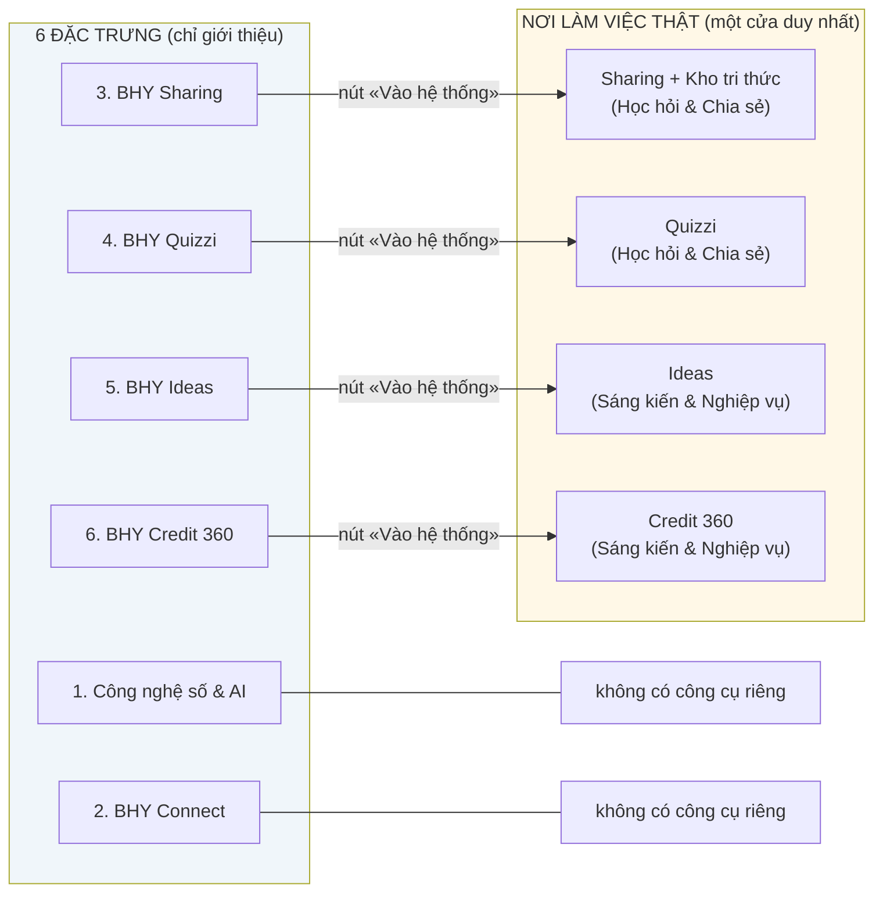

# Sơ đồ site BHY ONE — cấu trúc chốt sau tham vấn

**Cập nhật:** 30/07/2026 · Tài liệu thiết kế cấu trúc & trải nghiệm (chưa phải code)

Cổng nội bộ **VietinBank Bắc Hưng Yên ONE** — hợp nhất cổng BHY ONE cũ và
chieuthuc3.com thành một cổng chung cho toàn thể cán bộ sau đăng nhập.

**Mạch tư tưởng** (dùng để kể chuyện, KHÔNG dùng để xếp menu):
*Nguồn cội → Gieo suy nghĩ → Học hỏi → Hành động → Thói quen → Năng lực và
văn hóa → Thành quả và ghi nhận.*

**Nguyên tắc điều hướng đã chốt:**

1. Menu chính đúng 6 mục, xếp theo nhóm việc.
2. Mỗi chức năng chỉ có **một cửa** (một "nhà" duy nhất); trang đặc trưng chỉ
   giới thiệu + nút liên kết, không bao giờ nhúng form/dữ liệu.
3. Điều hướng 2 tầng: thanh ngang ONE là tầng 1; vào phân hệ 343 mới có menu
   dọc nhiều tầng riêng. Ở đâu cũng thấy thanh ONE — một cổng, không phải hai website.
4. Menu co giãn theo vai trò; việc lặp hằng ngày không quá 2 chạm (qua thao tác nhanh).
5. Quản trị người dùng là **một khu chung toàn cổng** theo nguyên lý chieuthuc3.com.

---

## 1. Sơ đồ tổng thể

```mermaid
flowchart TD
    LOGIN["🔐 Đăng nhập"] --> ROLE{"Vai trò?"}
    ROLE -->|"Cán bộ"| HOME["🏠 TRANG CHỦ ONE"]
    ROLE -->|"Khách đối tác<br/>(có thời hạn)"| GUESTVIEW["Trang chủ phần bản sắc<br/>+ Nguồn cội + bài Kho được chia sẻ"]

    HOME --> M2["🌳 NGUỒN CỘI<br/>& BẢN SẮC"]
    HOME --> M3["📚 HỌC HỎI<br/>& CHIA SẺ"]
    HOME --> M4["💡 SÁNG KIẾN<br/>& NGHIỆP VỤ"]
    HOME --> M5["⭐ GHI NHẬN<br/>& LAN TỎA"]
    HOME --> M6["👥 PHÁT TRIỂN<br/>NHÂN SỰ 343"]

    M2 --> M2A["Cây ký ức"]
    M2 --> M2B["Hành trình 20 năm 🆕"]
    M2 --> M2C["Những con người BHY 🆕"]
    M2 --> M2D["6 đặc trưng riêng có<br/>(chỉ giới thiệu + liên kết)"]
    M2 --> M2E["Bộ 3 Chiêu thức"]
    M2 --> M2F["Câu chuyện văn hóa"]

    M3 --> M3A["BHY Sharing + Kho tri thức 🔀<br/>(1 không gian, 2 tab)"]
    M3 --> M3B["BHY Quizzi<br/>(kèm khu quản trị 🔀<br/>chỉ hiện với người có thẩm quyền)"]

    M4 --> M4A["BHY Ideas 🔀<br/>(trang riêng)"]
    M4 --> M4B["BHY Credit 360 🔀<br/>(trang riêng)"]

    M5 --> M5A["Sao Xứng Đáng<br/>«mọi cán bộ ghi nhận lẫn nhau»"]
    M5 --> M5B["Điểm sáng trong ngày 🆕"]
    M5 --> M5C["Gương mặt & tập thể tiêu biểu 🆕"]
    M5 --> M5D["Câu chuyện tạo giá trị 🆕"]
    M5 --> M5E["Góc vinh danh 🆕"]

    M6 --> M6A["Cá nhân"]
    M6 --> M6B["Học tập"]
    M6 --> M6C["Quản trị đội ngũ<br/>(BHY Mark, Hội đồng đầu mối)"]
    M6 --> M6D["Chiến lược nhân sự"]
    M6 --> M6E["Biểu mẫu BM01–03"]
    M6 --> M6F["Quản trị phân hệ<br/>(chỉ cấu hình nghiệp vụ 343)"]

    HOME -.->|"admin"| ADMIN["🛡️ QUẢN TRỊ NGƯỜI DÙNG<br/>chung toàn cổng<br/>(nguyên lý chieuthuc3.com)"]

    style HOME fill:#003D7C,color:#fff
    style ADMIN fill:#E31B23,color:#fff
    style GUESTVIEW fill:#f5f5f5,stroke-dasharray: 5 5
```

Chú thích: 🆕 xây mới · 🔀 tách/gộp từ vị trí hiện tại · các nút không đánh dấu
là nội dung đã có, chỉ di chuyển chỗ.

## 2. Quy tắc "một chức năng một cửa"

Trang **6 đặc trưng riêng có** (thuộc Nguồn cội & Bản sắc) là nơi *nêu đặc
trưng* của chi nhánh. Đặc trưng có công cụ thì đặt nút liên kết sang trang làm
việc thật — không nhúng form hay dữ liệu vào trang đặc trưng.

Hai hệ ghi nhận **không trùng nhau**, mỗi trang có một câu định vị ngay đầu:

| | Sao Xứng Đáng | BHY Mark |
|---|---|---|
| Định vị | «Mọi cán bộ ghi nhận lẫn nhau» | «Hành động trọng điểm được Giám đốc trực tiếp đồng hành» |
| Bản chất | Khen thưởng chung, phong trào toàn chi nhánh | Công cụ của Ban Giám đốc |
| Vị trí | Ghi nhận & Lan tỏa | Phân hệ 343 → Quản trị đội ngũ |

## 3. Cây site đầy đủ

Ký hiệu: ✅ đã có (di chuyển chỗ) · 🔀 tách/gộp từ chỗ hiện tại · 🆕 xây mới ·
(GĐ2) giai đoạn 2.

### 🏠 Trang chủ ONE

- **ONE của tôi** (chỉ cán bộ, khách không thấy)
  - Tôi cần làm 🆕 — việc quá hạn/đến hạn, Quizzi hoặc biểu mẫu cần hoàn thành
    (gom từ dữ liệu sẵn có của 343)
  - Tôi đang làm 🆕 — bản rút gọn Kanban cá nhân từ hệ 343
  - Tôi được ghi nhận 🆕 — số Sao tích lũy + ghi nhận gần nhất (từ bảng Sao sẵn có)
  - Tôi cần biết 🆕 (GĐ2) — cần xây hệ thông báo mới, chưa có nền móng
- **5 thao tác nhanh**: Chia sẻ kinh nghiệm · Làm BHY Quizzi · Gửi BHY Ideas ·
  Đăng ký Credit 360 · Gửi Sao Xứng Đáng
- **Teaser bản sắc** (rút gọn, dẫn sang Nguồn cội — không lặp đủ nội dung):
  Cây ký ức · câu chuyện BHY · 6 đặc trưng · gương mặt tiêu biểu

### 🌳 Nguồn cội & Bản sắc

- Cây ký ức ✅
- Hành trình 20 năm 🆕
- Những con người BHY 🆕
- 6 đặc trưng riêng có ✅ (chuyển thành trang giới thiệu thuần):
  1. Công nghệ số & ứng dụng AI — chỉ giới thiệu
  2. BHY Connect — chỉ giới thiệu
  3. BHY Sharing — giới thiệu + liên kết
  4. BHY Quizzi — giới thiệu + liên kết
  5. BHY Ideas — giới thiệu + liên kết
  6. BHY Credit 360 — giới thiệu + liên kết
- Bộ 3 Chiêu thức ✅ (Năng Lượng Ngày Mới · Lập Kế Hoạch 5W2H · Phát Triển Nhân Sự)
- Câu chuyện văn hóa ✅

*(Tạo Ảnh 20 Năm: đã quyết định BỎ khỏi cấu trúc — gỡ khỏi ứng dụng 30/07/2026)*

### 📚 Học hỏi & Chia sẻ

- **BHY Sharing + Kho tri thức** 🔀 — một không gian, hai tab (vì chung một kho
  dữ liệu phía sau):
  - Tab «Dòng chia sẻ»: bài mới, đóng góp kinh nghiệm
  - Tab «Tra cứu kho»: tài liệu, hình ảnh, video, lọc theo phòng ban/chuyên mục/thẻ
  - Nút «Chia sẻ đối tác» trên từng bài — cửa DUY NHẤT để khách thấy dữ liệu
- **BHY Quizzi** 🔀 — nhà duy nhất của Quizzi:
  - Chơi quiz, chiến dịch, bảng kết quả (mọi cán bộ)
  - **Khu quản trị Quizzi** — đưa ra khỏi phân hệ 343, đặt ngay trong không gian
    Quizzi; thẩm quyền vào GIỮ NGUYÊN như hiện tại (quản lý trở lên mới thấy)

### 💡 Sáng kiến & Nghiệp vụ

- **BHY Ideas** 🔀 — tách ra trang riêng (hiện đang nằm trong tab đặc trưng):
  form 9 trường · danh sách theo 11 đơn vị · bình chọn + bình luận · thống kê,
  dự toán thưởng · quản trị cấp độ/chuyển phòng · xuất CSV
- **BHY Credit 360** 🔀 — tách ra trang riêng: đăng ký phiên họp 8 trường ·
  bảng tra cứu tìm kiếm/lọc phòng · sửa phiên của mình · quản trị xóa + xuất CSV

### ⭐ Ghi nhận & Lan tỏa

- **Sao Xứng Đáng** ✅ — định vị «mọi cán bộ ghi nhận lẫn nhau»:
  form gửi sao · phân tích 3 tab (cá nhân/phòng ban/chi tiết) · tủ quà ·
  nhập/xuất Excel (quản trị)
- Điểm sáng trong ngày 🆕
- Gương mặt & tập thể tiêu biểu 🆕
- Câu chuyện tạo giá trị 🆕
- Góc vinh danh 🆕
- *(Vận hành: phân công đầu mối cập nhật cho từng mục để nhịp đăng bài đều)*

### 👥 Phát triển nhân sự 343 (phân hệ chuyên sâu, menu dọc riêng)

- **Cá nhân** ✅ — tổng quan, tự đánh giá, hành động phát triển, hồ sơ cá nhân
- **Học tập** ✅ — chiến dịch học tập, mẹo hay, skill lõi theo vị trí
  *(Quizzi phổ cập đã đưa ra Học hỏi & Chia sẻ)*
- **Quản trị đội ngũ** ✅ — đội ngũ phòng ban, đánh giá cán bộ, phân nhóm,
  báo cáo, **Dấu ấn BHY Mark** («hành động trọng điểm được Giám đốc đồng hành»),
  Hội đồng đầu mối. *KHÔNG còn Quản trị Quizzi (đã chuyển sang không gian Quizzi)*
- **Chiến lược nhân sự** ✅ — bản đồ rủi ro năng lực, con đường sự nghiệp,
  mô phỏng điều chuyển
- **Biểu mẫu** ✅ — BM01 · BM02 · BM03
- **Quản trị phân hệ** 🔀 — CHỈ còn cấu hình nghiệp vụ 343: kỳ đánh giá,
  cấu hình skill, tiêu chí level, khóa học VietinBank, nhu cầu đào tạo, email…
  *(phần người dùng chuyển sang khu Quản trị người dùng chung)*

### 🛡️ Quản trị người dùng — CHUNG TOÀN CỔNG (admin-only)

Một khu duy nhất, lấy nguyên lý chieuthuc3.com làm chuẩn (danh sách cán bộ +
hệ phân quyền hiện có là danh sách chuẩn nhất):

- Danh sách cán bộ chuẩn (thêm/sửa/upload danh sách) ✅
- Phòng ban & chức danh ✅
- Phân quyền (7 vai trò) ✅
- Duyệt yêu cầu tài khoản ✅
- Tài khoản khách đối tác (tạo + đặt hạn theo ngày) ✅

**Mọi phân hệ** — ONE, Sharing/Kho, Quizzi, Ideas, Credit 360, Sao, 343 — dùng
chung nguồn người dùng này. Không phân hệ nào có màn quản trị user riêng.

## 4. Bảng vai trò × khu vực

| Khu vực | Cán bộ | Quản lý / PGD | TCTH & system admin | BGĐ | Khách đối tác |
|---|---|---|---|---|---|
| Trang chủ — ONE của tôi | ✔ | ✔ | ✔ | ✔ | ✘ |
| Trang chủ — phần bản sắc | ✔ | ✔ | ✔ | ✔ | ✔ |
| Nguồn cội & Bản sắc | ✔ | ✔ | ✔ (sửa nội dung) | ✔ | ✔ |
| Sharing + Kho tri thức | ✔ | ✔ | ✔ | ✔ | Chỉ bài được chia sẻ |
| Quizzi — chơi | ✔ | ✔ | ✔ | ✔ | ✘ |
| Quizzi — khu quản trị | ✘ | ✔ | ✔ | ✔ | ✘ |
| Ideas / Credit 360 | ✔ | ✔ | ✔ (quản trị) | ✔ | ✘ |
| Sao Xứng Đáng | ✔ | ✔ | ✔ (nhập/xuất) | ✔ | ✘ |
| Vinh danh (4 mục) | ✔ xem | ✔ xem | ✔ đăng | ✔ | ✘ |
| 343 — Cá nhân / Học tập / Biểu mẫu | ✔ | ✔ | ✔ | ✔ | ✘ |
| 343 — Quản trị đội ngũ (gồm BHY Mark) | ✘ | ✔ phòng mình | ✔ | ✔ (Mark) | ✘ |
| 343 — Chiến lược nhân sự | ✘ | ✘ | ✔ | ✔ | ✘ |
| 343 — Quản trị phân hệ | ✘ | ✘ | ✔ | ✘ | ✘ |
| Quản trị người dùng (chung) | ✘ | ✘ | ✔ | ✘ | ✘ |

Khách đối tác ngoài các ô ✔ bị chặn ở cả 3 lớp: điều hướng (danh sách trắng),
database (RLS) và kho tệp (vùng shared/).

## 5. Lộ trình

**Giai đoạn 1 — sắp lại điều hướng: ✅ ĐÃ TRIỂN KHAI (30/07/2026).**
Menu 6 mục (`/one` · `/one/nguon-coi` · `/one/hoc-hoi` · `/one/sang-kien` ·
`/one/ghi-nhan` · Nhân sự 343) · Ideas tách ra `/one/y-tuong`, Credit 360 ra
`/one/credit-360` (trang đặc trưng chỉ còn giới thiệu + nút liên kết) ·
Sharing + Kho gộp tại `/one/hoc-hoi` (2 tab) · Sao Xứng Đáng về `/one/ghi-nhan` ·
quản trị Quizzi chuyển vào không gian Quizzi (thẩm quyền giữ nguyên) ·
nhóm sidebar "Quản trị người dùng" chung toàn cổng · Trang chủ mới với 3 khối
"ONE của tôi" (Cần làm / Đang làm / Được ghi nhận) + 5 thao tác nhanh + teaser
bản sắc · link cũ (`/one/dac-trung`, `/one/chieu-thuc`, `/one/kho-du-lieu`)
chuyển hướng tự động.

**Giai đoạn 2 — xây phần chưa có nền:** hệ thông báo cho "Tôi cần biết" ·
4 mục vinh danh mới · Hành trình 20 năm · Những con người BHY.

**Ngoài phạm vi đợt này:** đề án "Bắc Hưng Yên Kanban" thay Miro (nghiên cứu
riêng) — Kanban cá nhân trên Trang chủ hiện chỉ là bản tổng quan từ hệ 343.

---

## 6. Cập nhật 08/2026 — gộp Trang chủ, tách tab theo Chiêu thức

Cấu trúc ở các mục trên là bản chốt tháng 7/2026. Tháng 8/2026 Chi nhánh điều
chỉnh lại như sau (đã triển khai):

### Thanh menu chính còn 5 tab

| # | Tab | Đường dẫn | Vai trò |
|---|---|---|---|
| 1 | **Trang chủ** | `/one` | Việc của tôi + giới thiệu bản sắc và hệ sinh thái |
| 2 | **Bắc Hưng Yên Ways** | `/one/bhy-ways` | Hệ sinh thái 6 thương hiệu có tính năng |
| 3 | **Chiêu thức 2** | `/one/chieu-thuc-2` | Kế hoạch hành động Chi nhánh (5W2H + PDCA) |
| 4 | **Phát triển nhân sự 343** | phân hệ | Chiêu thức 3 — giữ nguyên như cũ |
| 5 | **Quản trị người dùng** | phân hệ | Admin, giữ nguyên |

### Những thay đổi cụ thể

- **Trang «Nguồn cội & Bản sắc» đã GỘP vào Trang chủ.** Cổng chỉ còn một cửa vào;
  phần bản sắc (20 năm, Cây ký ức) nằm ngay dưới khối việc của tôi. Trang chủ từ
  đây chỉ *giới thiệu* rồi dẫn sang trang riêng — không nhúng form hay dữ liệu.
- **«Bắc Hưng Yên Ways»** là tên chính thức của hệ sinh thái. Câu định vị:
  > Bắc Hưng Yên Ways là hệ sinh thái các phương thức, công cụ và cơ chế quản trị
  > được VietinBank Bắc Hưng Yên xây dựng, áp dụng và liên tục cải tiến nhằm phát
  > triển tri thức, thúc đẩy sáng kiến, tăng cường kết nối, kiểm soát rủi ro và
  > ghi nhận những đóng góp xứng đáng.

  Sáu thương hiệu bên dưới: Sharing · Quizzi · Ideas · Connect · Sao Xứng Đáng ·
  Credit 360. Riêng **Connect** chưa có công cụ trực tuyến — trang nói thẳng điều
  đó thay vì dựng nút dẫn tới trang trống.
- **«Bắc Hưng Yên 3806»** là tên bộ khung năng lực: **38** kỹ năng lõi + **06**
  nhóm thái độ. Đây là trang *chỉ giới thiệu* (`/one/bhy-3806`), nằm trong phân hệ
  Phát triển nhân sự. Nơi làm việc thật (tự chấm, duyệt phiếu, IDP) vẫn ở phân hệ
  343 như cũ.
- **Chiêu thức 2 có tab riêng** kèm một tính năng mới: bảng Kanban kế hoạch hành
  động của cả Chi nhánh (xem mục dưới).
- **Chiêu thức 1** (Năng lượng ngày mới) là nếp sinh hoạt hằng ngày, không có màn
  hình riêng — chỉ giới thiệu trên Trang chủ.
- Link cũ đều chuyển hướng, không gãy bookmark: `/one/nguon-coi`, `/one/dac-trung`,
  `/one/chieu-thuc` → `/one`; `/one/sang-kien` → `/one/bhy-ways`.

### Kanban kế hoạch hành động Chi nhánh (Chiêu thức 2)

Khác hẳn Kanban hiện có: `kanban_cards` là hành động phát triển **năng lực của
từng cán bộ**, sinh từ phiếu tự đánh giá. Bảng mới `action_plans` là kế hoạch hành
động **của cả Phòng** theo 5W2H.

| Vai trò | Xem được |
|---|---|
| Cán bộ / lãnh đạo Phòng | Kế hoạch của phòng mình |
| Phó Giám đốc | Các phòng mình phụ trách |
| Giám đốc · BGĐ · TCTH | Toàn Chi nhánh |
| Mọi phòng trong chiến dịch chung | Kế hoạch của chiến dịch đó |

- **Chiến dịch chung liên phòng**: lãnh đạo Phòng trở lên khởi tạo rồi thêm các
  phòng khác vào; mọi phòng tham gia đều xem và cùng báo nhịp.
- **Nhật ký PDCA không sửa, không xóa** — là bằng chứng trung thực. Mọi cán bộ
  trong phạm vi đều ghi được, không phải đặc quyền của lãnh đạo.
- **Bảng thi đua xếp theo nhịp báo cáo tuần TRƯỚC khối lượng.** Phòng ít việc mà
  tuần nào cũng báo đứng trên phòng nhiều việc bỏ bẵng — đây chính là hành vi cần
  tạo động lực, không phải chạy theo số lượng đầu việc.
- RLS là hàng rào thật, dùng lại bộ helper sẵn có (`is_dept_manager`,
  `get_my_pgd_scope_dept_ids`, `is_tcth_leader`). Khách đối tác bị chặn hoàn toàn.

**Khi triển khai:** phải áp migration
`20260805090000_chieu_thuc_2_ke_hoach_hanh_dong_phong.sql` vào project Supabase.
Chưa áp thì trang Chiêu thức 2 hiện lời nhắc rõ ràng thay vì màn lỗi trắng.
